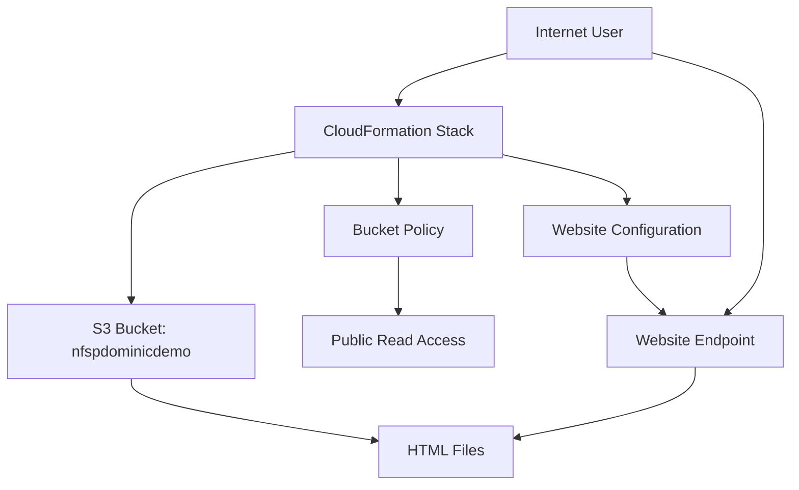
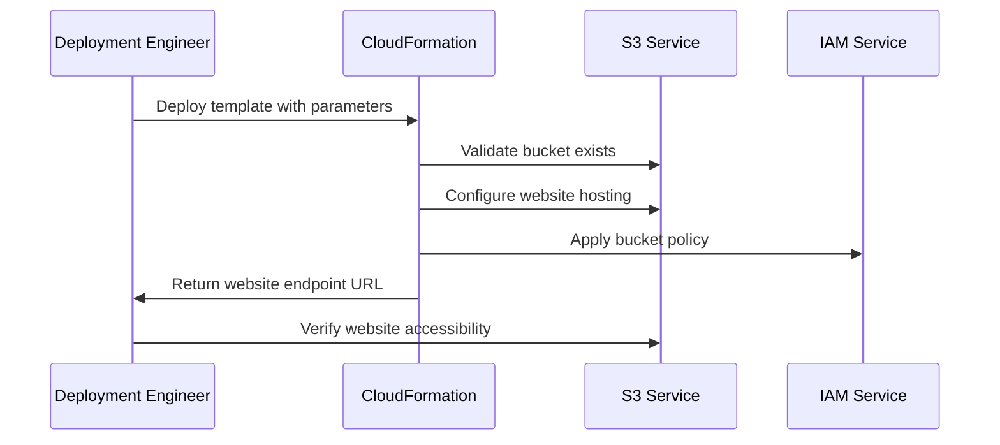

# Design Document

## Overview

The S3 Static Website CloudFormation feature provides a reusable Infrastructure as Code solution for hosting static websites using Amazon S3. The solution transforms an existing S3 bucket into a publicly accessible static website through CloudFormation template deployment, enabling consistent and repeatable infrastructure provisioning across environments.

The design centers around a parameterized CloudFormation template that configures S3 bucket website hosting, establishes appropriate IAM policies for public read access, and provides clear outputs for deployment validation. The template accepts the existing S3 bucket name "nfspdominicdemo" as a parameter, making it reusable for other buckets and environments.

## Architecture

### High-Level Architecture



### Component Architecture

The solution consists of three primary components:

1. **CloudFormation Template**: Infrastructure as Code definition containing all AWS resources
2. **S3 Bucket Configuration**: Website hosting settings applied to the existing bucket
3. **IAM Bucket Policy**: Security controls enabling public read access while maintaining least privilege

### Deployment Flow



## Components and Interfaces

### CloudFormation Template Structure

The template follows AWS CloudFormation best practices with clear separation of parameters, resources, and outputs:

**Parameters Section:**
- `BucketName`: Required string parameter for the S3 bucket name
- `IndexDocument`: Optional parameter with default "index.html"
- `ErrorDocument`: Optional parameter with default "error.html"

**Resources Section:**
- `S3BucketWebsiteConfiguration`: Configures the bucket for static website hosting
- `S3BucketPolicy`: Establishes public read access permissions

**Outputs Section:**
- `WebsiteURL`: Complete website endpoint URL
- `BucketWebsiteConfiguration`: Configuration status confirmation

### S3 Website Configuration Interface

The S3 website configuration resource interfaces with the existing bucket to enable:
- Static website hosting mode
- Index document specification
- Error document handling
- Public access endpoint generation

### IAM Bucket Policy Interface

The bucket policy resource creates a JSON policy document that:
- Grants `s3:GetObject` permissions to all principals (`*`)
- Restricts access to objects within the specified bucket
- Follows least-privilege security principles
- Enables anonymous public read access

### Parameter Validation Interface

CloudFormation parameter constraints ensure:
- Bucket name format validation using regex patterns
- Required parameter enforcement
- Default value provision for optional parameters
- Clear parameter descriptions for user guidance

## Data Models

### CloudFormation Template Schema

```yaml
AWSTemplateFormatVersion: '2010-09-09'
Description: 'S3 Static Website Hosting Configuration'

Parameters:
  BucketName:
    Type: String
    Description: 'Name of the existing S3 bucket to configure for website hosting'
    AllowedPattern: '^[a-z0-9][a-z0-9-]*[a-z0-9]$'
    ConstraintDescription: 'Bucket name must be valid S3 bucket naming convention'
  
  IndexDocument:
    Type: String
    Default: 'index.html'
    Description: 'Name of the index document for the website'
  
  ErrorDocument:
    Type: String
    Default: 'error.html'
    Description: 'Name of the error document for the website'

Resources:
  # Resource definitions here

Outputs:
  # Output definitions here
```

### Bucket Policy Document Model

```json
{
  "Version": "2012-10-17",
  "Statement": [
    {
      "Sid": "PublicReadGetObject",
      "Effect": "Allow",
      "Principal": "*",
      "Action": "s3:GetObject",
      "Resource": "arn:aws:s3:::BUCKET_NAME/*"
    }
  ]
}
```

### Website Configuration Model

The S3 website configuration follows AWS S3 website hosting specifications:
- **IndexDocument**: Default document served for directory requests
- **ErrorDocument**: Custom error page for 4xx errors
- **RoutingRules**: Optional URL redirection rules (not required for basic hosting)

## Error Handling

### CloudFormation Deployment Errors

**Bucket Existence Validation:**
- Pre-deployment validation ensures the specified S3 bucket exists
- If bucket doesn't exist, CloudFormation fails with descriptive error message
- Error message includes bucket name and suggests creating the bucket first

**Permission Errors:**
- IAM permission validation during policy application
- Clear error messages for insufficient deployment permissions
- Rollback mechanism for partial deployment failures

**Parameter Validation Errors:**
- Bucket name format validation using AllowedPattern constraints
- Descriptive ConstraintDescription messages for validation failures
- Type checking for all input parameters

### Runtime Website Errors

**HTTP Status Code Handling:**
- 200 OK for successful content retrieval
- 404 Not Found for missing files, served via custom error document
- 403 Forbidden for access denied scenarios (should not occur with proper policy)

**MIME Type Configuration:**
- Automatic MIME type detection for common web file types
- Proper Content-Type headers for HTML, CSS, JavaScript, and image files
- Default handling for unknown file types

**Error Document Strategy:**
- Custom error.html page for user-friendly error messages
- Fallback to S3 default error handling if custom error document missing
- Consistent error experience across all website paths

## Testing Strategy

This Infrastructure as Code feature uses CloudFormation for AWS resource provisioning and configuration. Property-based testing is not appropriate for this type of infrastructure deployment, as it involves declarative configuration rather than algorithmic logic with varying inputs.

### Testing Approach

**Template Validation:**
- CloudFormation template syntax validation using `aws cloudformation validate-template`
- Parameter constraint testing with valid and invalid inputs
- Resource dependency validation

**Integration Testing:**
- Deploy template to test AWS environment
- Verify S3 bucket website configuration is applied correctly
- Test public website accessibility through generated endpoint
- Validate bucket policy permissions allow public read access
- Confirm proper HTTP status codes and MIME types

**Security Testing:**
- Verify bucket policy restricts access to read-only operations
- Test that write/delete operations are properly denied
- Validate least-privilege access controls

**Deployment Testing:**
- Test template deployment with different parameter combinations
- Verify rollback functionality on deployment failures
- Test deployment time meets 5-minute requirement

**Error Scenario Testing:**
- Test deployment with non-existent bucket name
- Test with invalid parameter formats
- Verify descriptive error messages for common failure scenarios

The testing strategy focuses on infrastructure validation, deployment verification, and security compliance rather than property-based testing, which is appropriate for this CloudFormation-based solution.